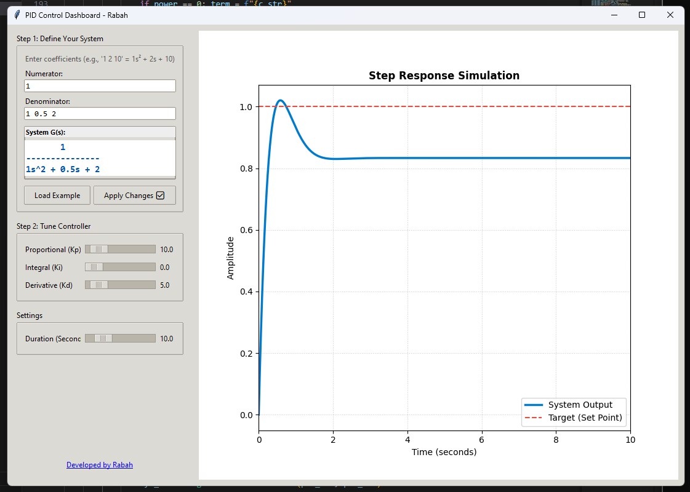

# 🎛️ Interactive PID Control Dashboard

A real-time, interactive GUI for simulating and tuning **PID Controllers**. Designed to bridge the gap between control theory math and visual intuition.



## 🚀 Overview

This tool allows engineers and students to visualize how Proportional ($K_p$), Integral ($K_i$), and Derivative ($K_d$) gains affect a physical system. Unlike static plots, this dashboard lets you **drag sliders** and see the step response update instantly.

You can simulate **any linear system** by defining its Transfer Function coefficients directly in the interface.

## ✨ Features

* **Real-Time Tuning:** Adjust PID gains and watch the graph react immediately.
* **Custom Plant Models:** Define any system transfer function $G(s)$ using numerator/denominator coefficients.
* **Live Equation Preview:** Instantly sees the math representation of the system you are building (e.g., $\frac{1}{s^2 + 0.5s + 2}$).
* **Robust Simulation:** Uses `scipy.signal` to handle complex differential equations behind the scenes.
* **Safety Features:** "Confirm" button prevents crashes while typing coefficients; error handling for unstable/invalid systems.

## 📦 Prerequisites

You need **Python 3.x** and the following scientific libraries:

```bash
pip install numpy matplotlib scipy
```

## 🛠️ How to Run

1. Clone the repository (or download the pid_tuner.py file).
2. Install dependencies using the command above.
3. Run the application:
```bash
python pid_tuner.py
```

## 🧠 The Math Behind It

The simulator solves the closed-loop transfer function $T(s)$ for a standard feedback loop:

1.  **The Plant** $G(s)$: The physical system you defined (e.g., a motor, a heater).
2.  **The Controller** $C(s)$:
    $$C(s) = K_p + \frac{K_i}{s} + K_d s$$
3.  **The Closed Loop**:
    $$T(s) = \frac{C(s)G(s)}{1 + C(s)G(s)}$$

The software then computes the **Step Response** (the system's reaction to a sudden change in desired position) over the selected time duration.

## 📝 Usage Example

To simulate a "Bouncy" Mass-Spring-Damper system:
1. Numerator: 1
2. Denominator: 1 0.5 2 (Represents $1s^2 + 0.5s + 2$)
3. Tune:
    - Increase $K_p$ to reach the target faster (will overshoot).
    - Increase $K_d$ to add "friction" and stop the bouncing.
    - Increase $K_i$ to fix steady-state error (if any).

## 👨‍💻 Developer
Rabah Djebbes